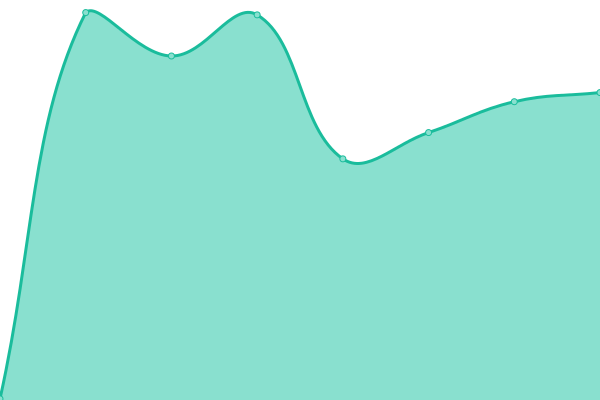

# [📈 Live Status](https://hegrog.github.io/uptime): <!--live status--> **🟩 All systems operational**

This repository contains the open-source uptime monitor and status page for [hegrog](https://hegrog.github.io/uptime), powered by [Upptime](https://github.com/upptime/upptime).

With [Upptime](https://upptime.js.org), you can get your own unlimited and free uptime monitor and status page, powered entirely by a GitHub repository. We use [Issues](https://github.com/hegrog/uptime/issues) as incident reports, [Actions](https://github.com/hegrog/uptime/actions) as uptime monitors, and [Pages](https://hegrog.github.io/uptime) for the status page.

<!--start: status pages-->
<!-- This summary is generated by Upptime (https://github.com/upptime/upptime) -->
<!-- Do not edit this manually, your changes will be overwritten -->
<!-- prettier-ignore -->
| URL | Status | History | Response Time | Uptime |
| --- | ------ | ------- | ------------- | ------ |
|  [BlinLab](https://blinlab.co) | 🟩 Up | [blin-lab.yml](https://github.com/hegrog/uptime/commits/HEAD/history/blin-lab.yml) | 

 461ms
     
 | 

<a href="https://hegrog.github.io/uptime/history/blin-lab">97.71%</a>
    

|  [Posicionato](https://posicionato.co) | 🟩 Up | [posicionato.yml](https://github.com/hegrog/uptime/commits/HEAD/history/posicionato.yml) | 

 534ms
     
 | 

<a href="https://hegrog.github.io/uptime/history/posicionato">100.00%</a>
    

|  [UpTheNetwork](https://upthenetwork.com) | 🟩 Up | [up-the-network.yml](https://github.com/hegrog/uptime/commits/HEAD/history/up-the-network.yml) | 

 499ms
     
 | 

<a href="https://hegrog.github.io/uptime/history/up-the-network">100.00%</a>
    

|  [Coccoswim](https://coccoswim.co/) | 🟩 Up | [coccoswim.yml](https://github.com/hegrog/uptime/commits/HEAD/history/coccoswim.yml) | 

 826ms
     
 | 

<a href="https://hegrog.github.io/uptime/history/coccoswim">97.77%</a>
    

<!--end: status pages-->

[**Visit our status website →**](https://hegrog.github.io/uptime)

## 📄 License

- Powered by: [Upptime](https://github.com/upptime/upptime)
- Code: [MIT](./LICENSE) © [hegrog](https://hegrog.github.io/uptime)
- Data in the `./history` directory: [Open Database License](https://opendatacommons.org/licenses/odbl/1-0/)
